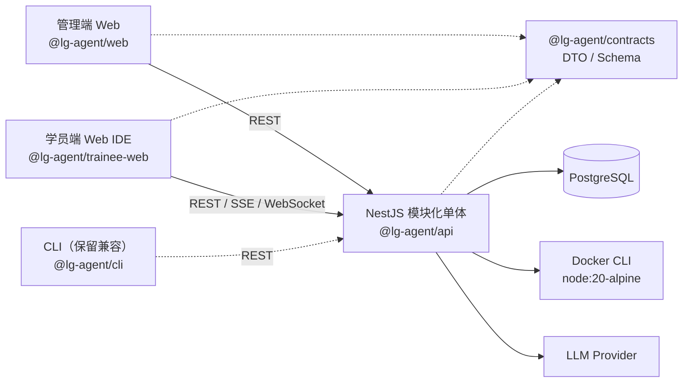

## 1. 总体架构设计（Overall Architecture）

> **文档定位（2026-07-27）**
>
> 本文同时描述“当前实现（As-Is）”与“目标形态（To-Be）”。除非明确标记为目标形态，架构判断以当前代码为准。当前后端不是一组独立微服务，也没有单独部署的 API Gateway；它是一个 NestJS **模块化单体**。模块化单体是当前阶段的主动选择，不应仅为了“未来可能拆分”提前增加网络 seam。

### 1.0 当前实现基线（As-Is）

当前部署与代码 seam：

| 模块 | 当前实现 | 关键 seam |
| --- | --- | --- |
| 客户端 | 管理端与学员端两个 React SPA；CLI 仅保留兼容 | `@lg-agent/contracts` |
| 后端 | 单个 NestJS 进程内的领域模块 | Nest Module exports 与依赖注入 token |
| 数据 | 核心状态由 PostgreSQL / Prisma 持久化 | Repository adapter |
| AI | `AiModule` 内的 LLM Gateway、过滤、基础文档 RAG、成本记录；Sprint 17 目标增加代码知识与统一上下文编排 | `ILLMProvider`、`IDocumentRetriever`、`ICodeRetriever`、`IContextOrchestrator` |
| Sandbox | API 进程调用 Docker CLI；日志通过 SSE 返回 | `IExecutor`，但当前运行时固定选择 Docker adapter |
| 提交评测 | API 进程内后台任务与内存事件总线 | `IExecutionEventBus`，当前只有内存 adapter |

### 1.0.1 演进原则

1. **先深化模块，再拆进程**：只有当独立扩缩容、故障隔离或独立发布成为真实需求时，才把模块 seam 升级为网络 seam。
2. **两个 adapter 才证明 seam**：`ILLMProvider` 已有多个生产/测试 adapter，是成立的 seam；只有一个实现的抽象应保持克制。
3. **接口即测试面**：测试优先通过领域模块的公开 interface，避免为了测试把实现拆成大量 shallow module。
4. **保持 locality**：提交生命周期、执行状态、日志流和恢复策略应集中在同一个深模块内；认证密钥读取也应集中到统一配置模块。
5. **删除测试**：删除一个候选模块若只会把同等复杂度搬到调用方，说明它是 shallow；若会迫使多处策略重新分散，说明该模块提供了有效 depth。

本项目采用**"CLI + Web Console + Backend Services + Sandbox + AI Service"**的分层架构设计，以满足企业私有化部署、高可扩展性、多租户管理以及未来 SaaS 化演进需求。

整体采用前后端分离和模块化设计。当前由 NestJS 应用承担统一接入、认证、授权、审计与业务编排；“独立 API Gateway”和“独立微服务”属于满足明确拆分门槛后的目标形态。

整体架构共分为六层：

### （1）客户端层（Client Layer）

负责人与系统交互，包括：

* CLI（开发者训练终端）
* Web Console（导师管理后台）
* Trainee Web（学员实战工作区）
* Android Mobile Companion（Sprint 20 目标形态）
* IDE Plugin（后续版本）

CLI 负责新人整个训练流程，包括：

* 登录认证
* 拉取任务
* 环境检测
* 本地沙盒执行
* AI 问答
* 上传学习记录

Web Console 主要负责：

* 课程管理
* 企业配置
* 数据统计
* 学员管理
* 效能分析

Trainee Web 负责完整的 Workspace、代码编辑、Run / Submission 和执行日志；Android Mobile Companion 只消费同一后端状态与共享契约，负责移动任务 read model、任务上下文 AI、结构化 CI 摘要、通知与 PC handoff。Android 不直接连接数据库、Docker、内部 Git 或 LLM Provider，也不实现独立任务状态机。

Sprint 20 继续复用 NestJS 模块化单体，不为移动端提前拆分 Mobile BFF 网络服务。可在现有模块内增加 `MobileReadModelService` / assembler，将 Task、Progress、Submission、Notification 和 AI 的授权结果聚合为移动 DTO；只有独立扩缩容、发布节奏或故障隔离证据出现时才升级为网络 seam。

* * *

### （2）接入层（Gateway Layer，目标形态）

当后端拆分为多个独立部署单元后，所有客户端统一通过独立 API Gateway 访问系统；当前请求直接进入 NestJS 应用。

主要职责：

* 身份认证（JWT）
* 企业 SSO 登录
* 权限控制（RBAC）
* API 路由
* 限流
* 日志记录
* 请求审计

后续可无缝接入：

* LDAP
* OAuth2
* 飞书
* 钉钉
* 企业微信

* * *

### （3）业务服务层（Business Service Layer）

系统核心业务拆分为多个独立模块。

#### Training Service（训练引擎）

负责：

* 学习流程控制
* 六阶段状态流转
* 任务推进
* 通关判断

#### Task Service（课程管理）

负责：

* 课程管理
* 章节管理
* 任务管理
* 文档资源管理

#### Progress Service（学习记录）

负责：

* 学习记录
* 通关状态
* 成绩统计
* 历史提交

#### AI Service（AI 导师）

负责：

* Prompt 构建
* 普通文档的结构化分块、关键词/向量混合检索、重排与父级展开
* 项目代码的 AST/符号索引、精确搜索、关系图与按需符号读取
* 文档、代码、Workspace、执行日志和会话的统一查询路由
* Token 预算、L0/L1/L2 渐进披露、缓存和会话压缩
* Code Review
* AI 对话
* 学习提示
* 文档版本、代码 commit 和行/符号级可追溯引用

#### Sandbox Service（沙盒执行）

负责：

* Docker Sandbox
* 环境准备
* 自动测试
* CI 校验
* Linter
* 安全隔离

#### Analytics Service（数据分析）

负责：

* 学习分析
* 通关统计
* 卡点分析
* 效能 Dashboard

* * *

### （4）基础设施层（Infrastructure）

包括：

* PostgreSQL
* Redis
* Object Storage（MinIO）
* Docker Engine
* Kubernetes
* GitLab
* Jenkins

用于支撑：

* 数据持久化
* 文件存储
* 自动部署
* 容器调度
* CI/CD

* * *

### （5）AI 能力层（AI Capability）

AI 当前是 NestJS 模块化单体内的深模块，不直接耦合业务逻辑；只有出现独立扩缩容、故障隔离或发布需求时才拆分为独立服务。

主要组成：

* Prompt Builder
* Query Router
* Context Orchestrator
* Document Retrieval（Structured Chunk / Hybrid Search / Rerank / Parent Expansion）
* Code Intelligence（AST / Symbol Index / Relation Graph / `read_symbol`）
* Token Budget 与 L0/L1/L2 Progressive Disclosure
* Versioned Cache 与 Conversation Compactor
* Evidence / Citation Trace
* LLM Gateway
* Model Provider

支持接入：

* OpenAI
* Qwen
* DeepSeek
* 企业私有模型

避免业务层直接调用模型，提高可维护性。

* * *

### （6）企业资源层（Enterprise Resource）

系统可与企业已有基础设施集成，包括：

* GitLab
* GitHub Enterprise
* Jenkins
* Harbor
* LDAP
* Confluence
* Notion
* 飞书知识库

真正做到利用企业已有资产生成训练内容，而非重新维护一套知识体系。

* * *

