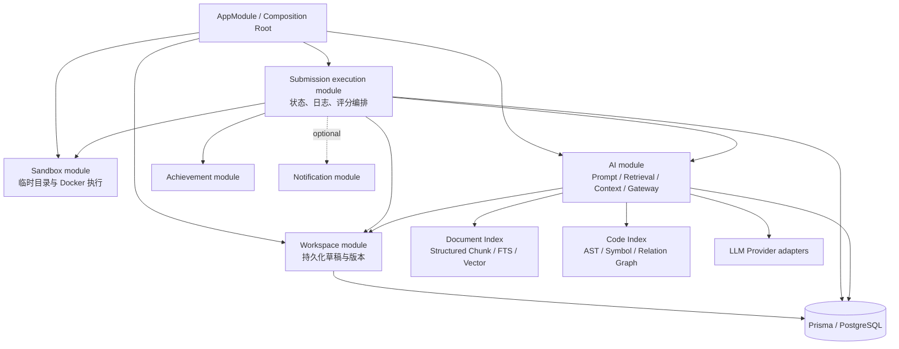
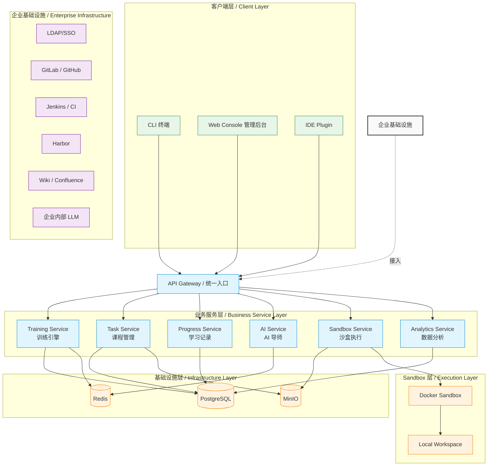

## 3. 系统架构设计（System Architecture）

### 3.0 当前模块拓扑与架构判断

当前 `@lg-agent/api` 是模块化单体，`AppModule` 统一装配认证、组织、课程、任务、训练、Workspace、Sandbox、提交、AI、通知、可观测性等模块。这里的 “Service” 表示领域能力，不表示独立进程。

#### 已完成的深化决策

| 优先级 | 模块 | 问题 | 深化方向 | 收益 |
| --- | --- | --- | --- | --- |
| Strong | Submission execution | 已删除 Training legacy 提交入口；`POST /api/v1/submissions/run` 是唯一入口 | Submission 集中拥有状态机、持久事件、重试恢复、Workspace 快照、Sandbox 调度和终态 hooks | locality：执行故障集中；leverage：一个 interface 支撑提交、日志订阅、取消与恢复 |
| Strong | Auth configuration | `AuthConfigModule` 统一提供经验证的密钥、算法与 token 期限 | Auth、JWT strategy 与 Notification gateway 注入同一 `AUTH_CONFIG`，不存在 fallback secret | locality：认证配置只有一个来源；测试只需覆盖一个 interface |
| Strong | Workspace / execution workspace | `AuthoringWorkspaceService` 与 `ExecutionWorkspaceService` 已按生命周期拆分 | 持久草稿/版本归 Workspace；规范化 staging copy 与清理归 Sandbox | seam 含义清晰，减少错误注入与跨模块泄漏 |
| Strong | Sandbox executor | `IExecutor` 已有 Docker/Local 两个 contract-compatible 实现 | composition root 选择 executor/runtime profile；Local adapter 在生产环境被拒绝 | leverage：调用方不感知执行实现；安全策略具有 locality |
| Speculative | 进程拆分 | 文档把各领域写成独立服务，但当前没有独立扩缩容、发布或故障隔离证据 | 保持模块化单体；达到拆分门槛再将已有 seam 升级为网络 adapter | 避免浅网络模块与分布式复杂度 |

#### 学员端 Workspace Session

学员端已由 deep `WorkspaceSession` module 唯一拥有 authoring session 的远端基线、本地草稿、未保存变更、离线快照、版本和执行状态。页面只通过少量 command 与 selector 使用它；HTTP、IndexedDB 和执行调用隐藏为内部 port/adapter。首次加载、冲突恢复、自动保存、版本回滚和提交由同一公开 interface 的 contract test 覆盖。

#### 依赖规则

1. Controller 只调用所属领域模块的公开 interface，不直接跨模块访问 Prisma。
2. 跨模块调用必须通过被调用模块导出的 interface；禁止深路径导入其内部实现。
3. `@lg-agent/contracts` 只承载跨进程/跨包契约，不承载 NestJS、Prisma 或前端状态实现。
4. Composition Root 负责选择 adapter；领域模块不在构造器中自行固定具体 adapter。
5. Submission execution 是 Workspace、Sandbox、AI、Achievement、Notification 的编排者；被编排模块不得反向依赖它。
6. AI 查询统一由 `IQueryRouter → IDocumentRetriever/ICodeRetriever → IContextOrchestrator` 编排；Controller、Tutor strategy 和 Prompt Builder 不得直接查询向量表、全文索引或 AST 存储。
7. 文档版本与代码 commit 是检索和 citation 的不可变边界；索引 adapter、缓存和会话摘要不得把不同版本证据静默合并。

以下为目标形态的分层视图；当前实现拓扑以 3.0 节为准：
                        企业基础设施
     ┌────────────────────────────────────────────┐
     │ LDAP │ GitLab │ Jenkins │ Harbor │ LLM │ Wiki │
     └────────────────────────────────────────────┘
                          │
                          ▼
                  API Gateway（统一入口）
                          │
     ┌────────────────────────────────────────────┐
     │                                            │
     │   Training Service                         │
     │   Task Service                             │
     │   Progress Service                         │
     │   AI Service                               │
     │   Sandbox Service                          │
     │   Analytics Service                        │
     │                                            │
     └────────────────────────────────────────────┘
              │             │             │
              ▼             ▼             ▼
          PostgreSQL      Redis       MinIO
              │
              ▼
          Docker Sandbox
              │
              ▼
          Local Workspace

### 模块职责

#### API Gateway（目标形态）

当前由 NestJS 应用承担统一接入、认证授权、日志与接口路由。只有在多后端进程、统一流量治理或独立安全域成为真实需求后，才部署独立 Gateway adapter。

* * *

#### Training Service

系统核心流程控制模块。

负责：

* 六阶段训练流程
* 学习状态机
* 阶段切换
* 通关逻辑

* * *

#### Task Service

负责课程生命周期管理。

包括：

* 创建课程
* 编辑任务
* 上传文档
* 管理资源
* 发布版本

* * *

#### Progress Service

负责学习过程记录。

包括：

* 当前进度
* 提交记录
* 通关成绩
* Retry 次数
* 学习耗时

* * *

#### Sandbox Service

负责所有代码执行。

执行流程：

1. Workspace 创建

2. 环境检测

3. 依赖安装

4. Docker 隔离运行

5. Lint 检查

6. Unit Test

7. CI Script

8. 生成评分结果

当前 Sandbox 提供进程级 Docker 隔离与基础资源限制，但仍由 API 进程直接管理 Docker CLI、临时目录和日志流；完成 6.6 节安全约束并拆分 Runner 后，才能达到更强故障隔离。

* * *

#### AI Service

AI 当前是 NestJS 进程内 `AiModule`；只有独立扩缩容、发布或安全域成为真实需求时，才演进为独立部署。

主要职责：

* 普通文档结构化 Hybrid RAG
* 代码 AST/符号检索与关系图按需展开
* 文档、代码、任务状态与会话的查询路由
* Token 预算、L0/L1/L2 渐进披露、缓存与会话压缩
* Evidence 汇总和版本化 citation
* Prompt 拼接
* Code Review
* 学习问答
* 错误解释
* 学习建议生成

所有 AI 请求统一经过 LLM Gateway，实现模型切换、Token 控制、敏感信息脱敏及日志审计。

* * *

#### Analytics Service

负责生成研发效能数据，包括：

* 平均通关时间
* 卡点统计
* AI 使用频率
* Retry 次数
* 知识掌握情况
* 企业培训 ROI 分析

为研发负责人提供量化决策依据。

