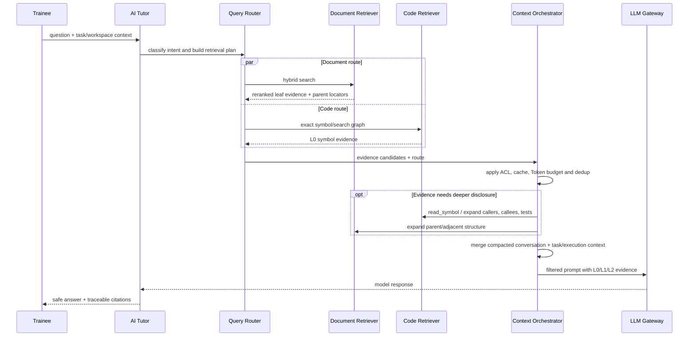
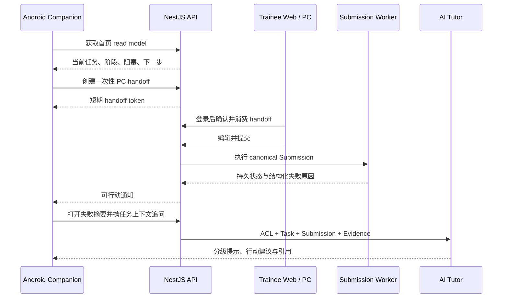

## 4. 核心业务流程（Core Business Flow）

系统围绕"学习任务驱动"设计整体业务流程，将企业静态文档转化为可执行、可验证、可反馈的学习过程。整个业务流程覆盖课程创建、任务下发、环境搭建、代码实践、自动评测及学习分析等完整生命周期。

### 4.1 课程创建流程

Mentor 可通过 Web Console 创建新的培训课程，并将企业现有知识资产转换为训练任务。

流程如下：

1. 创建课程

2. 上传文档（Markdown / Wiki）

3. 上传代码模板

4. 配置环境(env_map)

5. 配置 Sandbox

6. 配置自动测试

7. 配置 AI Prompt

8. 发布课程

其中，一个完整课程主要由以下资源组成：

| 资源           | 说明              |
| ------------ | --------------- |
| Task.yaml    | 课程元数据           |
| env_map.json | 环境依赖描述          |
| docs/        | 学习文档            |
| workspace/   | 初始代码模板          |
| tests/       | 自动测试脚本          |
| scripts/     | CI、Lint 等执行脚本   |
| prompt/      | AI 导师 Prompt 配置 |

课程发布后即可分配给指定团队或新人。

* * *

### 4.2 学员学习流程

开发者使用 CLI 登录后，系统自动完成任务初始化，并进入训练流程。

整体流程如下：

1. CLI 登录

2. 获取用户信息

3. 获取当前任务

4. 下载 Workspace

5. 环境检测

6. 自动安装依赖

7. 开始学习

8. AI 问答

9. 本地编码

10. 提交任务

11. 自动评测

12. AI Review

13. 通过 / 返回修改建议

整个过程中，学习者无需频繁切换 Wiki、浏览器及 CI 页面，可在统一终端完成全部训练流程。

* * *

### 4.3 六阶段训练流程（Training Pipeline）

系统将每个训练任务拆分为六个阶段，每个阶段均具有明确的输入、输出及验收标准。

| 阶段      | 模块                 | 功能              |
| ------- | ------------------ | --------------- |
| Stage 1 | Environment Check  | 检测本地开发环境        |
| Stage 2 | Knowledge Learning | 阅读任务说明及业务背景     |
| Stage 3 | AI Interaction     | AI 导师答疑、知识引导    |
| Stage 4 | Coding Practice    | 完成代码开发          |
| Stage 5 | Sandbox Validation | 自动测试、Lint、CI 验证 |
| Stage 6 | AI Review          | AI 生成代码评审及学习建议  |

相比传统培训流程，该模型具有以下优势：

* 每一步均可验证；
* 每一步均可回溯；
* 每一步均可统计；
* 每一步均支持 AI 辅助。

* * *

### 4.4 提交流程

每次提交都会生成一次 Submission，并进入统一评测流程。

> **当前实现**：`POST /api/v1/submissions/run` 是唯一提交入口。它从 Authoring Workspace 创建版本，并统一触发持久执行、日志、评分、成就、通知和 AI Review；旧的 Training 提交入口已删除。

1. Submit

2. 保存提交记录

3. 创建 Sandbox

4. 执行 Build

5. 执行 Unit Test

6. 执行 Integration Test

7. 执行 Linter

8. 生成测试报告

9. AI Code Review

10. 返回学习建议

当前评测对 HTTP 提交请求表现为异步：接口先创建 `PENDING` Submission，database execution adapter 通过 lease/heartbeat 认领任务。状态机、execution event log、幂等、指数退避、dead-letter、人工重放和重启恢复均以 PostgreSQL 为持久真相源；SSE 使用持久事件序列支持断线续订。

只有出现数据库 lease queue 无法满足的多实例吞吐、独立扩缩容或故障隔离证据时，才增加 Redis/RabbitMQ 等 queue adapter；客户端继续只依赖 Submission 状态与日志订阅 interface。

### 4.5 Workspace Authoring Session

学员端的标准 authoring 流程为：

```text
Load remote Workspace
  → Reconcile offline snapshot
  → Edit local draft
  → Auto-save / manual snapshot
  → Materialize execution Workspace
  → Run or Submit
  → Reconcile result and version
```

该流程应由一个 `WorkspaceSession` 深模块拥有。远端 Workspace、Zustand、IndexedDB 和页面局部状态不得各自成为真相源；冲突策略、未保存状态与版本恢复必须通过同一 interface 测试。

### 4.6 AI 导师知识检索流程（Sprint 17 目标）

AI Tutor 的 Chat、Hint、Explain Error、Code Review 和 Follow-up 共用同一检索编排，不允许各 action 自行拼接 RAG 或读取代码库。



执行规则：

1. Query Router 输出 `DOCUMENT`、`CODE`、`MIXED`、`TASK_STATE`、`CONVERSATION` 的有界 Retrieval Plan。
2. 文档路径执行结构化分块候选的关键词/向量混合检索、融合、重排和父级展开。
3. 代码路径先精确定位符号，再由 Agent 按需 `read_symbol`；只有复杂排障/评审才展开调用链和相关测试。
4. Context Orchestrator 从 L0 开始，按证据价值提升到 L1/L2，所有读取共享一个 Token Budget。
5. 版本化缓存仅复用同 organization、ACL、文档版本、代码 commit 和检索策略的结果。
6. 长会话只保留最近消息原文；历史轮次压缩为带 Evidence ID 的摘要。
7. 最终回答必须携带文档版本/章节或 repository commit/文件范围/符号引用；无证据结论明确标记为模型推断。

* * *

### 4.7 Android 移动协同流程（Sprint 20 目标）

Android 不创建新的训练流程，而是投影同一 Task、Workspace、Submission、AI Conversation 与 Notification 状态。



约束：

1. Android 不能直接修改 Workspace 文件或调用 Sandbox execute；Run / Submission 继续由 Web / PC 发起。
2. push payload 只包含不敏感摘要和资源引用，打开目标后重新认证授权并拉取最新状态。
3. handoff token 短期、单次、绑定 actor / organization / target，并支持撤销与审计。
4. 移动端本地状态只用于 UI 与受控缓存；刷新后必须以服务端状态机为准。
5. AI 错误解释使用同一 Retrieval / Safety pipeline，并执行提示阶梯策略。

* * *

