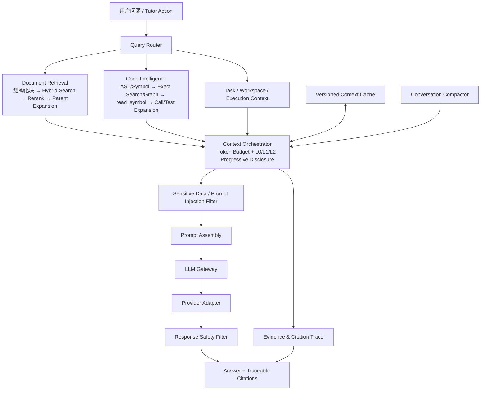

## 5. AI 架构设计（AI Architecture）

> **当前实现基线与目标演进（2026-07-28）**
>
> AI 能力当前内嵌于 `@lg-agent/api` 的 `AiModule`，不是独立部署进程。`ILLMProvider` 已有 Mock、OpenAI、DeepSeek adapter。Prompt repository、过滤规则 repository、vector-store seam 和 Workspace repository 均通过依赖注入装配；RAG 可由 `RAG_VECTOR_STORE` 选择 Memory（开发/测试默认）或 PostgreSQL pgvector（持久索引）。文中未标记“未来”的外部知识源、限流和企业 DLP 均属于目标能力。
>
> 当前 RAG 仍以 Markdown 切分和向量相似度检索为主。本文新增的结构化分块、关键词与向量混合检索、重排、父级展开、AST/符号索引、关系图、渐进披露和会话压缩均为 Sprint 17 的目标形态，不应标记为已经实现。

AI 导师不直接把完整文档、代码库或会话历史发送给模型，而是采用“知识索引 + 查询路由 + 渐进上下文 + LLM Gateway”的架构，以提高准确性、Token 利用率、安全性和引用可追溯性。

整体架构如下：



* * *

### 5.1 Prompt Builder (Epic 15)

负责构建系统 Prompt，包括：

* 企业角色设定
* 回复规范
* 输出格式
* 安全约束
* 禁止回答内容

保证不同模型输出保持一致。

**Prompt 存储与管理机制**：
- **MVP 存储介质**：文件（推荐 JSON 或 YAML），便于版本管理、Code Review 和后续迁移，避免将 Prompt 硬编码在 TS 文件中。
- **业务访问方式**：统一通过 `IPromptRepository` 接口，`PromptBuilderService` 不感知底层存储介质。
- **治理元数据**：每个模板必须声明语义版本、用途、输入 JSON Schema，可选声明输出 JSON Schema；仓库加载时 fail-fast 校验，Prompt Builder 在调用前与结构化响应解析后执行 Schema 校验。
- **回归边界**：AI Review、任务生成和 Tutor action 均只通过模板 id 访问 Prompt，业务服务不再保存 system prompt。
- **后续演进**：当需要运营人员维护 Prompt、A/B 测试、版本管理、审批流程时，仅新增 `PrismaPromptRepository`（或 Langfuse 等外部实现），无需修改核心业务逻辑。

* * *

### 5.2 Context Builder

Context Builder 演进为统一 `ContextOrchestrator`。它不自行扫描数据库、文件系统或向量库，而是通过公开 port 调用文档检索、代码检索、Workspace、Submission 和 Conversation 能力。

上下文来源包括：

* 当前课程、任务与学习阶段；
* Authoring Workspace 中的活动文件、选区和未保存状态摘要；
* Submission、测试失败、Linter 和执行日志；
* 文档知识证据与代码符号证据；
* 经压缩的会话摘要和最近消息。

核心不变量：

1. 先由 Query Router 判断 `DOCUMENT`、`CODE`、`MIXED`、`TASK_STATE` 或 `CONVERSATION` 路径，再分配检索预算。
2. 每个来源必须返回统一 Evidence，不允许直接返回无来源文本。
3. Context Orchestrator 拥有 Token 预算、去重、排序、渐进披露和截断；Prompt Builder 只消费已组装上下文。
4. Workspace 全量文件、代码库全量文件和完整长期会话不得直接进入 Prompt。

* * *

### 5.3 RAG 企业知识库

系统将企业知识分为“普通文档知识”和“项目代码知识”。二者共享上层查询、预算与引用协议，但使用不同的索引和展开策略；不得把源代码当普通文本块处理，也不得用向量检索替代符号精确定位。

当前直接支持的数据来源：

* Markdown
* Coding Guideline
* Architecture Design

Wiki、Confluence、Notion、PDF/DOCX 等来源需要先经过 Document Import adapter 规范化，不能视为已经接入。

`AiModule` 是检索 adapter 的 composition root。当前 `IVectorStore` 仍可选择 Memory 或 pgvector；Sprint 17 在其上新增 `IDocumentRetriever`、`ICodeRetriever`、`IQueryRouter` 和 `IContextOrchestrator`，调用方不感知底层全文索引、向量库或 AST parser。

#### 5.3.1 普通文档：结构化 Hybrid RAG

```text
Document Version
  → Structure Parser
  → Document Tree / Structured Chunks
  → Keyword + Vector Candidate Retrieval
  → Score Fusion
  → Reranker
  → Parent Expansion
  → Evidence with Citation
```

**结构化分块**

- 以文档版本为不可变索引单元，保留标题层级、章节路径、段落、列表、表格、代码块、页码和锚点。
- 叶子块用于召回；父节点用于补足语义。每个 chunk 必须携带 `documentId`、`versionId`、`parentId`、`sectionPath`、`ordinal` 和 source locator。
- 分块优先遵循结构边界；仅在节点超过上限时按 Token 窗口二次切分，并保留 overlap 与父子关系。
- 文档更新生成新版本；新索引 ready 前继续服务上一版本，禁止原地覆盖造成引用漂移。

**混合检索与重排**

1. 关键词通道使用全文索引/BM25 等价实现，负责术语、错误码、API 名称和精确短语。
2. 向量通道负责语义召回；两路候选先执行 ACL/Organization Scope 过滤。
3. 使用 Reciprocal Rank Fusion（RRF）或可配置等价算法融合排名，避免直接比较不同分数空间。
4. Reranker 只处理融合后的有界候选集，并记录模型/版本、输入数量、输出分数和耗时。
5. 对 Top-K 叶子块执行父级展开，按 Token 预算选择相邻段落或父章节；去重后输出 Evidence。
6. reranker 不可用时降级为融合排序，向量通道不可用时降级为关键词检索，不得让 AI Tutor 整体不可用。

#### 5.3.2 项目代码：AST / Symbol Intelligence

```text
Repository + Commit
  → Language Detection
  → AST Parser Adapters
  → Symbol Index + Reference/Relation Graph
  → Exact Search
  → Agent read_symbol
  → Callers / Callees / Tests Expansion
  → Evidence with Repository Citation
```

**索引单元与标识**

- 以 `repositoryId + commitSha` 作为不可变 Code Snapshot；分支名只用于解析 commit，不作为引用版本。
- AST parser adapter 输出统一 Symbol：module、class、interface、function、method、field、type、test 等。
- `symbolId` 由 snapshot、语言、规范化路径、qualified name、kind 和 signature 稳定派生。
- Symbol 保存签名、范围、doc comment、所属父符号和轻量摘要；符号正文按需读取，不默认复制到向量索引。
- 关系图至少支持 `DEFINES`、`IMPORTS`、`REFERENCES`、`CALLS`、`IMPLEMENTS`、`EXTENDS`、`TESTS`。

**精确搜索与 Agent 工具**

- 第一阶段使用 symbol name、qualified name、path、signature、引用和错误堆栈位置执行精确搜索；语义代码搜索只能作为补充召回。
- `search_symbols` 返回 L0 摘要和候选 symbolId，不返回大量源码。
- `read_symbol(symbolId, level)` 是 Agent 读取代码的规范入口，仅允许读取已索引、已授权 snapshot 内的符号。
- `expand_symbol(symbolId, relationTypes, depth, limit)` 按需展开 callers、callees、implementations、references 和 tests。
- 调用链扩展必须有深度、节点数和 Token 上限；遇到环时按 symbolId 去重并标记 cycle。
- 测试扩展优先读取直接 `TESTS` 关系，再回退到命名、路径和引用启发式，并标记证据置信度。
- Parser 不支持、语法错误或生成代码时保留 file-level fallback；不得伪造不存在的符号关系。

#### 5.3.3 统一查询路由与渐进披露

`IQueryRouter` 根据用户意图、Tutor action、活动文件、错误日志和已有 Evidence 生成 Retrieval Plan。路由可以并行选择文档、代码和任务状态，不把“混合查询”强制压成单一来源。

渐进披露分为：

| Level | 内容 | 典型用途 |
| --- | --- | --- |
| L0 | 标题/符号名、签名、路径、短摘要、版本、分数、citation | 首轮候选筛选 |
| L1 | 完整结构化块、符号正文、直接父节点或局部上下文 | 回答具体概念、API 或实现问题 |
| L2 | 父章节、相邻块、调用链、实现类、引用点、相关测试 | 复杂排障、Code Review、影响分析 |

- 默认从 L0 开始；只有信息不足或 Agent 明确选择 Evidence 时才提升到 L1/L2。
- 每次提升必须从统一 Token Budget 扣减，并保留选择原因。
- L2 不是“读取整库”；任何展开仍受组织权限、快照版本、深度、节点数和 Token 上限约束。

#### 5.3.4 Token Budget、缓存与会话压缩

**Token Budget**

- 预算按 system/policy、任务状态、最近会话、文档证据、代码证据和输出预留分区。
- 先为安全指令和输出保留硬预算，再按 Retrieval Plan 动态分配文档/代码预算。
- 超预算时按 Evidence 边际价值截断，不允许截断 citation locator 后仍保留正文。

**缓存**

- 索引缓存 key 包含 organization、source/repository、document version 或 commit SHA、parser/chunker/embedding 版本。
- 检索缓存 key 还必须包含 ACL fingerprint、query normalization、route、filters 和 retrieval policy version。
- Context cache 只保存已脱敏 Evidence 引用和有界片段；权限、文档版本、commit 或安全策略变化时失效。
- 禁止跨 organization 共享含正文的缓存；共享 embedding 模型缓存不得携带租户内容。

**会话压缩**

- Conversation Compactor 保留学习目标、用户已确认事实、未解决问题、关键决策、Evidence ID 和 citation。
- 最近 N 轮保留原文，较旧消息压缩为版本化摘要；摘要生成过程同样经过敏感信息过滤和审计。
- 新 Evidence 与既有摘要冲突时，以版本化来源为准并触发重新压缩，不允许摘要覆盖新事实。

#### 5.3.5 可追溯引用与检索质量

统一 Evidence 至少包含：

```text
evidenceId, sourceType, organizationId,
documentId/versionId/chunkId 或 repositoryId/commitSha/path/symbolId,
locator, disclosureLevel, retrievalChannel,
rawRank, fusedRank, rerankScore, parentEvidenceId
```

- 最终回答中的事实性陈述引用 Evidence ID；客户端可解析为文档章节、页码、文件行范围或符号预览。
- Retrieval Trace 记录 query route、候选数、融合、重排、展开、缓存命中、Token 选择和最终 Evidence，但不持久化未脱敏 Prompt 或源码全集。
- 离线评测集同时覆盖 Recall@K、MRR/nDCG、citation precision、answer groundedness、路由准确率、Token/有效证据比和 P95 延迟。
- 每次 chunker、parser、embedding、fusion、reranker 或 routing policy 变更都必须运行回归评测，并支持按索引版本回滚。

* * *

### 5.4 LLM Gateway

所有模型调用均经过统一网关。

主要职责包括：

* **Provider + Adapter 架构**：业务层禁止直接依赖任何 LLM SDK。网关抽象出 `ILLMProvider` 契约，底层通过不同的 Provider 实现（如 `OpenAIProvider`）接入各大模型。
* **模型兼容性**：`OpenAIProvider` 使用 `@langchain/openai`，通过 `OPENAI_BASE_URL` 和 `OPENAI_DEFAULT_MODEL` 支持 OpenAI-compatible API。Qwen 当前属于这种配置方式，不是独立 adapter；只有出现不同协议或行为契约时才新增 `QwenProvider`/local-model adapter。
* **业务解耦**：后续新增模型时，仅需新增对应 Provider（如果需要实现特殊协议），不影响业务层代码。
• Provider Routing

• Model Selection

• Token Usage

• Prompt Logging

• Streaming

• Retry

• Timeout

• Rate Limiting

• Audit Log

• Sensitive Data Filter

• Response Safety Filter

• Cost Statistics

• Model Fallback

未来可根据企业预算灵活切换不同模型，而无需修改业务代码。

* * *

### 5.5 Provider Adapter

LLM Gateway 不直接依赖任何具体模型 SDK，而是采用 Provider + Adapter 模式。

业务层统一调用：

LLMProvider

接口。

各 Provider 负责：

- Prompt 转换
- SDK 调用
- Streaming
- Tool Calling
- Token Usage
- Retry
- Timeout

当前注册的 adapter：

- OpenAI Provider（基于 @langchain/openai）
- DeepSeek Provider（兼容 OpenAI API）
- Mock Provider（开发与测试）

Qwen 等 OpenAI-compatible 模型当前可通过兼容 base URL 接入，但没有独立 `QwenProvider` 实现。

未来支持：

- Anthropic
- Gemini
- Azure OpenAI
- Ollama
- vLLM
- 企业私有 Gateway

新增 Provider 不影响业务代码。

### 5.5.1 AI 模块深化约束

- `LLMGatewayService` 是模型调用的唯一 interface，过滤、fallback、成本记录不得泄漏到调用方。
- Prompt 组装、Workspace 上下文、RAG 检索属于一次 AI 请求的内部 pipeline，测试应从 pipeline/interface 验证调用顺序与安全不变量。
- `AiModule` 作为 composition root 可以装配多个实现，但不应继续向外导出内部 matcher、executor 或 repository。
- Provider SDK 只能出现在 `providers/` adapter 内；架构契约测试会阻止其他 AI 代码直接导入 SDK。
- Gateway 对 chat、stream、embed、fallback、请求/响应过滤、成本与审计执行同一契约。每次尝试生成 request id 与 trace id，并记录 user、organization、conversation、SHA-256 prompt hash、rule hits 和 fallback 来源（适用时），但不持久化原始 Prompt。
- AI 请求日志保留 180 天、安全审计日志保留 365 天，由 Data Lifecycle 定时批量清理。规则 metadata 递归脱敏且不记录规则 pattern；仅组织管理员可通过 `/ai/audit/requests` 读取本组织的有界结果集。

### 5.6 Sensitive Data Filter

所有发送至 LLM 的上下文均需经过 Sensitive Data Filter。

主要职责：

- API Key 脱敏
- Access Token 脱敏
- JWT 脱敏
- SSH Key 脱敏
- Cookie 脱敏
- 数据库连接串脱敏
- 企业域名脱敏
- 内网 IP 脱敏
- 邮箱脱敏（可配置）
- 企业配置脱敏

MVP 阶段采用：

Rule Engine + Regex。

后续可接入：

Microsoft Presidio

企业 DLP

实现智能敏感信息识别。

### 5.7 Response Safety Filter

模型返回内容进入客户端前统一经过 Response Safety Filter。

负责：

- 危险命令检测
- Prompt Injection 输出检测
- 敏感内容检测
- 企业规范校验
- Markdown 安全过滤
- HTML/XSS 过滤

确保 AI 返回内容符合企业安全要求。

### 5.8 AI 能力边界

AI 不直接决定是否通关，而是作为辅助模块参与训练过程。

AI 负责：

* 学习问答
* 错误解释
* Code Review
* 学习建议
* 文档总结
* 示例生成

平台负责：

* 自动测试
* CI 验证
* 通关判断
* 权限控制
* 学习统计

这种设计能够保证最终结果仍以程序验证为准，避免模型误判影响培训质量。

* * *

