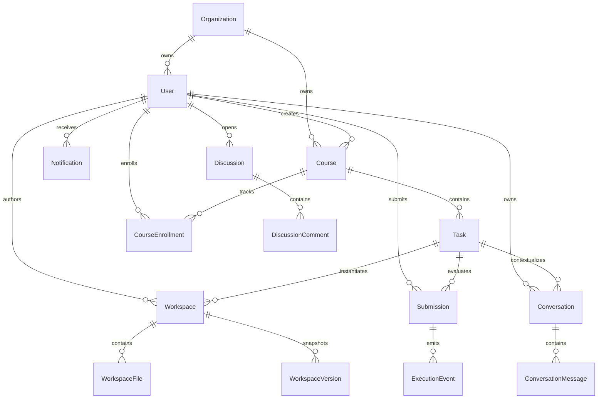

## 7. 数据库设计（Database Design）

> **Source of truth（2026-07-27）**
>
> 当前数据库使用 PostgreSQL，Schema、关系、字段类型和映射表名以 `packages/api/prisma/schema.prisma` 与 migrations 为唯一实现真相。本文描述领域所有权、不变量和演进约束，不复制完整 DDL。修改 Schema 时必须同时提交 migration 并更新本章的领域模型。

### 7.1 领域模型

### 7.2 当前实体清单

| 领域 | Prisma model | 所有权与用途 |
| --- | --- | --- |
| Tenant / Identity | `Organization`, `User` | 组织与账号；User 属于一个 Organization |
| Learning content | `Course`, `Task` | Course 属于 Organization，Task 属于 Course |
| Learning progress | `CourseEnrollment`, `Submission`, `ExecutionEvent` | 课程进度、执行 lease/attempt、事件序列与评测结果；AI Review 当前保存在 `Submission.aiReview` JSON |
| Authoring Workspace | `Workspace`, `WorkspaceFile`, `WorkspaceVersion` | 学员草稿、文件及快照 |
| AI conversation | `Conversation`, `ConversationMessage` | 按 organization/user/task 保存对话 |
| AI operations | `LlmRequestLog`, `LlmAuditLog` | Token、成本、时延与安全审计事件 |
| Engagement | `UserBadge`, `Notification`, `NotificationPreference`, `UserPreference` | 成就、通知与用户设置 |
| Mentor collaboration | `Discussion`, `DiscussionComment` | 任务、Workspace、Submission 上下文的讨论 |
| Observability | `ClientLog`, `ClientMetric`, `AuditEvent` | 前端日志、体验指标与平台审计 |
| Platform config | `SystemConfig` | 支持加密标记的系统配置 |

不存在独立 `user_progress` 或 `review_logs` 表；对应能力分别由 `CourseEnrollment` / `Submission` 和 `Submission.aiReview` 表达。

#### 7.2.1 Sprint 17 目标知识索引模型

下列为目标领域模型；名称可在 Prisma 设计评审时调整，但所有权、版本边界与唯一约束不得丢失：

| 领域 | 目标模型 | 所有权与用途 |
| --- | --- | --- |
| Knowledge source | `KnowledgeSource`, `KnowledgeDocument`, `DocumentVersion` | Organization 拥有知识源；文档版本是不可变索引与引用边界 |
| Document structure | `DocumentNode`, `DocumentChunk` | 保存标题树、父子关系、结构化叶子块、locator、全文索引与 embedding 引用 |
| Code source | `CodeRepository`, `RepositorySnapshot`, `CodeFile` | Organization 拥有代码库；snapshot 固定到 commit SHA |
| Code intelligence | `CodeSymbol`, `CodeRelation` | 保存 AST 符号、签名、范围以及调用、引用、继承、实现、测试关系 |
| Retrieval trace | `RetrievalTrace`, `RetrievalEvidence` | 记录路由、融合、重排、展开、Token 选择与最终 citation，不保存完整 Prompt/代码库副本 |
| Conversation memory | `ConversationSummary` | 保存版本化会话摘要、覆盖消息范围和引用的 Evidence ID |

大体积正文、源码 snapshot 与 parser artifact 优先由 object storage adapter 保存；PostgreSQL 保存元数据、权限、locator、关系和查询所需索引。pgvector 继续承担文档/可选代码摘要 embedding，不作为代码符号和关系图的唯一真相源。

### 7.3 核心不变量

#### Tenant scope

- `Course.organizationId` 与 `User.organizationId` 定义主要组织所有权。
- `Task` 通过 Course 继承组织作用域。
- Workspace、Submission、Discussion 等资源必须通过 User/Task 关系验证组织一致性。
- 应用查询由 `TenantScopeService` 统一生成 organization predicate；数据库触发器对 Submission、Workspace、Conversation、Discussion 的 user/task/关联资源组织一致性进行兜底验证。
- `ExecutionEvent` 的 organization scope 路径为 `ExecutionEvent → Submission → User.organizationId`，同时必须与 `Submission → Task → Course.organizationId` 一致。
- 禁止仅依赖客户端传入的 `organizationId` 过滤数据。

#### Workspace

- 每个用户对每个任务最多一个 Authoring Workspace：`@@unique([userId, taskId])`。
- Workspace 内文件路径唯一：`@@unique([workspaceId, path])`。
- 删除 Workspace 时级联删除 WorkspaceFile / WorkspaceVersion。
- WorkspaceVersion 的 `snapshot` 是 JSONB 全量快照；大规模文件、二进制资产或高频版本需要改用 object storage adapter，而不是无限扩张 JSONB。
- Sandbox 的 Execution Workspace 是临时文件系统状态，不属于此持久模型。

#### Submission

- 状态集合由 contract enum 表达，并由数据库 `submissions_status_check` 约束为 `PENDING`, `RUNNING`, `PASSED`, `FAILED`, `ERROR`, `CANCELLED`。
- 应用状态机负责合法迁移；数据库同时约束 score、attempt/retry 非负，以及 worker owner 必须具有 lease expiry。
- 幂等键唯一；同一 user/task 只允许一个 PENDING/RUNNING Submission；ExecutionEvent 的 `(submissionId, sequence)` 唯一且 sequence 必须为正数。
- durable execution 落地时，应把状态机与事件日志归 Submission execution 模块所有；不要让 Training、Sandbox 或 Notification 各自写状态。

#### AI

- Conversation 持有明确 organization/user/task 外键。
- `LlmRequestLog` 保存可空的 user/organization/conversation 上下文，以及 trace、Prompt hash、rule hits、fallback 来源、token 与成本；不保存原始 Prompt。无用户上下文的后台任务允许主体字段为空。
- `LlmAuditLog` 仅记录 AI 输入/输出过滤、安全规则命中与处置结果，唯一写入口是 `AiAuditService`；请求日志查询仅开放给组织管理员，并强制使用 actor 的 organization scope。
- `AuditEvent` 记录认证、授权及平台资源操作，唯一写入口是 `AuditProvider`，组织管理员只能查询本组织 actor/resource 范围；两者禁止共用写 repository 或面向普通学员暴露。
- RAG 通过 `IVectorStore` 选择 adapter：开发/测试默认使用 `MemoryVectorStore`，持久模式使用 PostgreSQL `knowledge_vectors` + pgvector；Milvus 仍是未来 adapter。
- DocumentVersion 与 RepositorySnapshot 一旦进入 `READY` 不可原地修改；内容变化必须创建新 version/snapshot。
- `DocumentChunk(parentId)` 必须位于同一 DocumentVersion；citation 必须同时保存版本与 locator。
- RepositorySnapshot 由 `(repositoryId, commitSha, parserVersion)` 唯一标识；CodeSymbol/CodeRelation 不得跨 snapshot 建立边。
- `symbolId` 在同一 snapshot 内唯一并稳定派生；`CodeRelation` 的起点、终点必须属于同一 organization 和 snapshot。
- RetrievalEvidence 只能引用调用主体有权访问的 source；删除权限后，缓存与后续 trace 查询必须立即失效或隐藏正文。
- ConversationSummary 必须记录覆盖的 message range、summary version 和 Evidence ID；不得删除尚未被摘要覆盖的原消息。

### 7.4 索引与约束

当前已明确的复合唯一键：

- `Workspace(userId, taskId)`
- `WorkspaceFile(workspaceId, path)`
- `CourseEnrollment(userId, courseId)`
- `UserBadge(userId, badgeCode)`
- `NotificationPreference(userId, type)`
- `UserPreference(userId, key)`

Epic 70 使用真实服务查询及 2,000～5,000 行隔离 fixture 执行 `EXPLAIN (ANALYZE, BUFFERS)`。以下索引均被对应读路径使用：

- Submission：`(userId, createdAt)`、`(taskId, createdAt)`、`(status, nextAttemptAt)`
- Task：`(courseId, stage)`
- ConversationMessage：`(conversationId, createdAt)`
- WorkspaceVersion：唯一 `(workspaceId, version)` 与时间清理索引
- Discussion：`(taskId, updatedAt)` 与 queue 使用的 `(status, assignedToId, updatedAt)`

Sprint 17 索引设计要求：

- DocumentChunk：`(documentVersionId, ordinal)` 唯一、`(documentVersionId, parentId)`、全文检索列 GIN、embedding ANN 索引
- RepositorySnapshot：`(repositoryId, commitSha, parserVersion)` 唯一、`(repositoryId, status, createdAt)`
- CodeFile：`(snapshotId, normalizedPath)` 唯一
- CodeSymbol：`(snapshotId, symbolId)` 唯一、`(snapshotId, qualifiedName)`、`(snapshotId, normalizedPath, startLine)`
- CodeRelation：`(snapshotId, fromSymbolId, relationType, toSymbolId)` 唯一，并为 from/to 两个方向建立遍历索引
- RetrievalTrace：`(organizationId, conversationId, createdAt)`；Evidence locator 使用有界字段，不在索引列复制完整源码

关键词与向量通道的候选查询必须先包含 organization/source ACL predicate，再执行排名；不得先跨租户召回再在应用层裁剪。

可重复查询计划位于 `packages/api/prisma/performance/epic70-explain.sql`，CI 将完整输出保存为 `epic70-query-plans` artifact。索引删除仍需结合生产 `pg_stat_user_indexes` 并由数据库负责人确认。

### 7.5 数据生命周期

| 数据 | 保留策略要求 |
| --- | --- |
| WorkspaceVersion | 每 Workspace 保留最新 50 个、至少保留最新 1 个，超过 90 天的旧快照分批删除 |
| Submission logs/report | 终态 payload 达 256 KiB 后进入 object-storage 归档候选；复制、checksum 验证成功后才允许清空数据库 payload |
| ConversationMessage | 对话 365 天无活动后分批删除其过期消息 |
| LlmRequestLog / LlmAuditLog | 分别保留 180 / 365 天；敏感正文不得写入 request log，安全规则事件写入 audit log |
| AuditEvent | 默认保留 2,555 天（7 年），仅安全管理员可缩短且必须满足组织合规要求 |
| ClientLog / ClientMetric | 分别保留 30 / 90 天；长期趋势进入聚合监控系统 |
| Notification | 使用 `expiresAt` 清理 |
| Document/Code index versions | 当前 ready 版本与至少一个可回滚版本保留；旧版本仅在无 citation/active conversation 引用且超过配置期限后清理 |
| RetrievalTrace / RetrievalEvidence | 默认保留 90 天；仅保留检索元数据、分数、locator 和有界脱敏片段 |
| ConversationSummary | 随 Conversation 生命周期清理；重新压缩成功后才删除被替代摘要 |
| Retrieval/Context cache | TTL 与 source ACL/version/commit 绑定；权限或版本变化立即失效，不作为审计真相源 |

`DataLifecycleService` 每日 03:00 执行上限为 `DATA_LIFECYCLE_BATCH_SIZE` 的清理，所有天数、Workspace 数量及 Submission 归档阈值均可通过环境变量配置。归档候选查询显式返回 `organizationId`，object key 必须以组织作用域为前缀。

### 7.6 Migration 与验证

1. Schema 变更必须生成 Prisma migration，禁止仅使用 `db push` 作为生产发布流程。
2. CI 运行 `prisma generate`、`prisma validate`、空库升级、上一 migration 升级、数据库 contract test 和 logical backup/restore。
3. 破坏性迁移采用 expand → migrate/backfill → contract 三阶段。
4. 新增 tenant-owned model 时，必须记录作用域路径并添加跨组织访问测试。
5. Backup/restore 演练必须覆盖 PostgreSQL；CI 使用 `pg_dump -Fc`、`pg_restore --exit-on-error` 并验证 migration 与核心约束，引入 object/vector/code index store 后分别增加对应 adapter 的恢复验证。
6. Sprint 17 migration 必须采用 expand → backfill/index → shadow read/evaluate → switch → cleanup；新索引未 ready 时继续读取上一 ready 版本。
