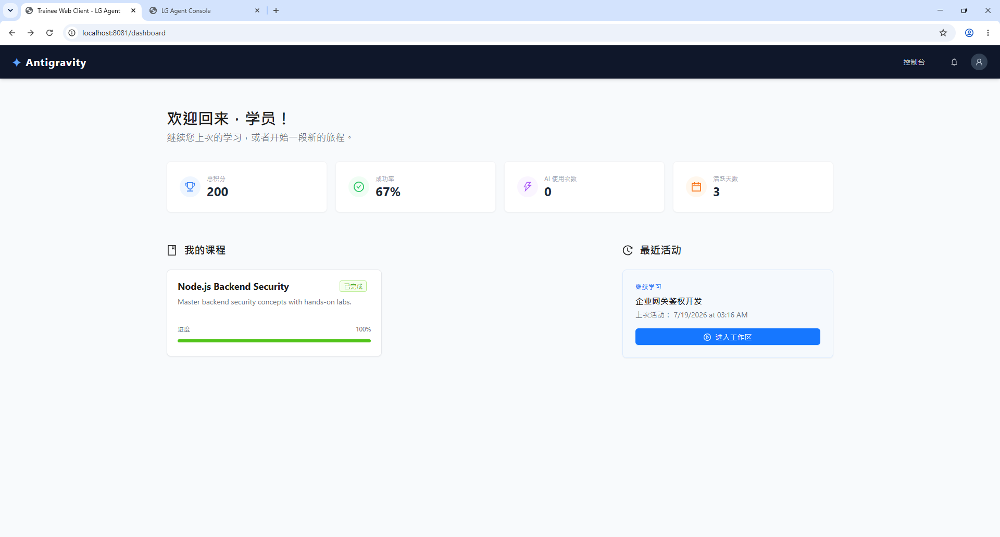
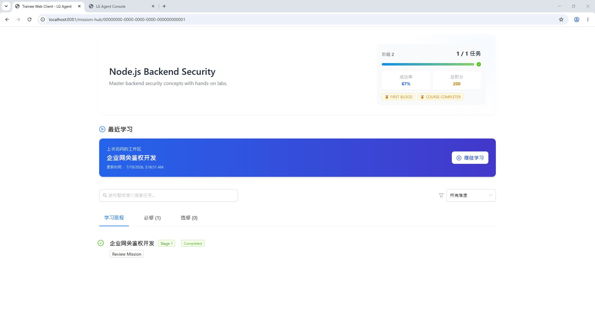
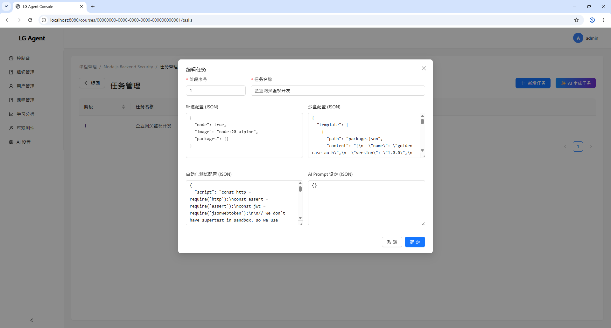
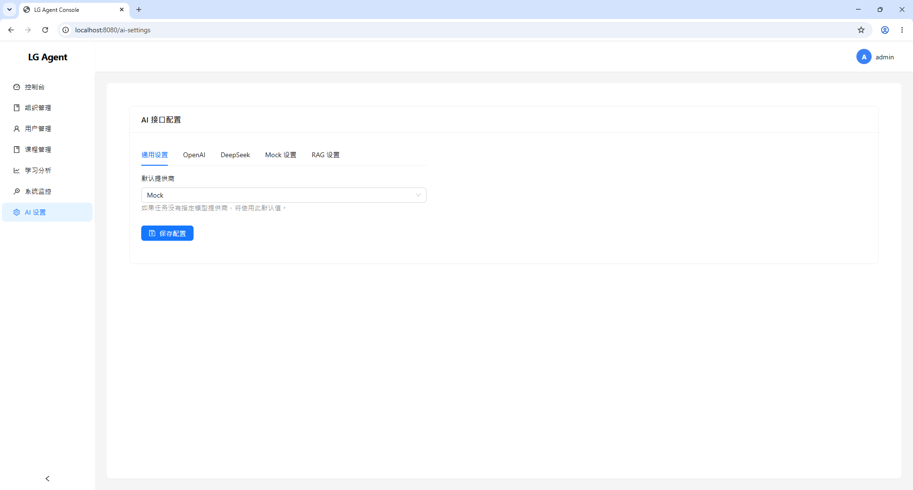

# LG Agent — AI 沉浸式企业入职引擎

> **"化被动阅读为主动实战"** — 将企业静态技术文档升级为可运行、可验证的 AI 沉浸式入职闯关引擎。

---

## 🎯 项目简介

LG Agent 是一个面向企业的 AI 驱动新人培训平台。通过自动化环境装配、六阶段闯关训练流程、沙盒代码执行与 AI 导师评审，将新人业务上手周期缩短 50%，资深工程师带教内耗降低 80%。

## 📸 界面预览 ([Screenshots](prod_docs/screenshot))






目前 **v1.0.0** 已经正式发布！我们完成了涵盖底层基础设施、认证、课程管理、集成 Monaco Editor 的 Trainee Web 工作区、沙盒代码执行引擎、AI 导师实时指导、RAG 知识库增强和 DevOps 观测监控等核心 Epic 的建设。

---

## 🏗️ 核心架构与文档

我们采用 Cloud-Native 企业级架构设计，所有服务与功能解耦，遵循 **Contract-First** API 治理规范。

📚 **核心文档导航**：

- [部署与使用文档 (prod_docs/)](prod_docs/index.md) - 面向运维与终端用户。
- [开发与内部设计文档 (dev_docs/)](dev_docs/index.md) - 面向核心研发与架构师。
- [产品发布文档总览](prod_docs/index.md)

👩‍💻 **用户手册**：

- [学员使用手册 (Trainee Manual)](prod_docs/User/Trainee_Manual.md)
- [导师使用手册 (Mentor Manual)](prod_docs/User/Mentor_Manual.md)

⚙️ **平台运维 (DevOps)**：

- [高可用系统拓扑 (System Topology)](prod_docs/System_Topology.md)
- [部署指南 (Deployment Guide)](prod_docs/Platform/01_Deployment_Guide.md)
- [安全生产指南 (Security Guide)](prod_docs/Platform/04_Security_Guide.md)

💻 **开发与架构 (Development)**：

- [本地搭建指南 (Local Setup)](dev_docs/Developer_Guide/01_Local_Setup.md)
- [系统核心架构 (System Architecture)](dev_docs/Architecture/01_System_Architecture.md)
- [数据库 ER 设计 (Database Design)](dev_docs/Architecture/02_Database_Design.md)

---

## 💻 技术栈 (Tech Stack)

| 核心层级       | 技术选型                                                                                           |
| -------------- | -------------------------------------------------------------------------------------------------- |
| **Monorepo**   | Turborepo, pnpm workspace, Changesets                                                              |
| **后端 API**   | NestJS, Prisma, PostgreSQL, `@nestjs/swagger`                                                      |
| **前端 Web**   | React 18, Vite, Ant Design, Monaco Editor, xterm.js                                                |
| **CLI 工具**   | Node.js, TypeScript, Commander.js _(已废弃, 请使用 Web 工作区)_                                    |
| **AI 引擎**    | OpenAI / DeepSeek adapters; Qwen via OpenAI-compatible configuration; Sensitive Filter Rule Engine |
| **沙盒执行**   | 自动化 Docker Runner                                                                               |
| **缓存与存储** | Redis, MinIO (S3 Compatible)                                                                       |
| **部署观测**   | Helm Charts, Multi-stage Dockerfiles, Pino, Prometheus, Terminus                                   |
| **质量工程**   | Vitest, Playwright, Strict ESLint                                                                  |

---

## 🚀 快速开始 (Quick Start)

### 1. 前置环境

- Node.js ≥ 20.6.0
- pnpm ≥ 9.0.0
- Docker & Docker Compose
- 推荐使用 Linux 或 macOS 环境进行本地开发。

### 2. 依赖安装与配置

首先，克隆项目并安装 Monorepo 依赖：

```bash
pnpm install
```

然后，配置项目所需的环境变量。建议直接复制示例文件并根据本地环境修改：

```bash
cp .env.example .env
```

_注意：请在 `.env` 中正确配置相关的 PostgreSQL 和 Redis 连接信息，以及必要的 AI Provider（OpenAI/DeepSeek）秘钥，也可以在系统的后台配置。_

### 3. 启动本地基础设施环境

启动本地依赖的中间件（PostgreSQL, Redis 等）：

```bash
docker compose up -d --wait
```

### 4. 数据库初始化

在仓库根目录执行一键、幂等的数据库初始化：

```bash
pnpm db:init
```

该命令会校验环境与 Schema、生成 Prisma Client、执行 `migrate deploy`、
对齐权限注册表与系统角色，并检查最终 migration 状态。它会自动读取
仓库根目录的 `.env`，可安全重复执行；
不会自动导入演示数据或创建管理员。不要在首次部署时直接使用
`pnpm --filter @lg-agent/api exec prisma ...`，因为该命令在 `packages/api` 中运行，
不会自动读取仓库根目录的 `.env`；CI/生产环境则可继续显式注入 `DATABASE_URL`。

### 5. 本地构建与启动

启动全部服务 (API + Web 管理端 + Trainee Web 学员端)：

```bash
pnpm run dev
```

- **Web 管理后台**: `http://localhost:8081/dashboard` （请以实际控制台输出端口为准）
- **Trainee Web 闯关工作区**: `http://localhost:8080/`
- **API 接口文档 (Swagger)**: `http://localhost:4000/api/docs`

> [!TIP]
> 系统的各项功能配置，包含大语言模型配置、RAG 设置以及 Sandbox 状态，均可以在 Web 管理后台的对应页面进行动态调整。

---

## 🛠️ 质量与工程规范 (Quality Engineering)

- **版本发布**: 借助 [Changesets](https://github.com/changesets/changesets) 完成语义化版本 (SemVer) 发布。
- **CI/CD**: 通过 GitHub Actions 自动化执行 Build, Lint, Typecheck, Test，以及 Registry-Agnostic 的镜像推送和发布。
- **API 治理**: 基于 Swagger 实现 OpenAPI 自动生成，确立 `@lg-agent/contracts` 作为单点契约。
- **代码提交**: 强制 Conventional Commits 规范，Husky 拦截钩子。

## 📄 许可证 (License)

本项目采用 [Apache License 2.0 with Commons Clause](LICENSE) 协议发布。

您可以免费下载、修改并在企业内部使用本作构建。但**严禁将本软件或其衍生品用于商业出售、转售，或将其包装为付费服务（SaaS）提供给第三方**。

更多详细条款与定义，请参阅完整的 [LICENSE](LICENSE) 文件。

---

> 🤖 **声明**：本项目代码与文档由 AI Agent 辅助生成，并经过人工严格审计。
