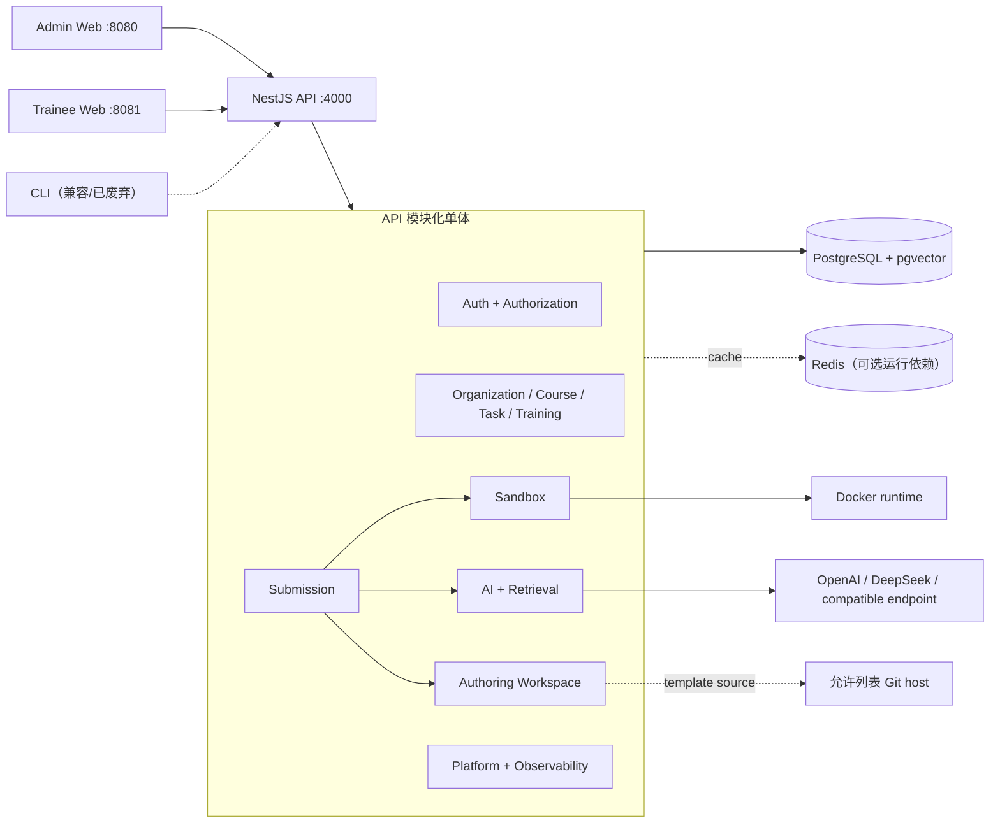

# LG-Agent 系统架构

## 架构基线

LG-Agent 是 pnpm/Turborepo 管理的模块化单体。NestJS API 按领域 module 组织；每个 domain 的 Nest module 是 composition root，通过 token 绑定 adapter。跨 domain 只能从 `index.ts` 进入公共 interface，`internal`、`repository`、`strategy`、`provider` 与 `adapter` 路径属于 implementation。

这一约束由 [ADR 0001](../../docs/adr/0001-modular-monolith.md) 和 `pnpm architecture:check` 强制执行。只有独立扩缩、故障隔离或所有权有实证需求时才引入网络 seam。

## 核心 module 与 seam

| Module               | 公共 interface                                      | 深层 implementation                                     |
| -------------------- | --------------------------------------------------- | ------------------------------------------------------- |
| Auth / Authorization | JWT actor、`RequirePermission`、permission registry | JWT 配置、策略、registry reconcile、审计                |
| Workspace            | Authoring Workspace 命令与版本                      | 数据库 repository、Git template source adapter          |
| Submission           | `run`、状态、日志、取消、replay                     | 幂等、租约、重试、事件、terminal hooks                  |
| Sandbox              | 执行请求与统一事件生命周期                          | Docker/local executor adapter、运行时 profile、安全策略 |
| AI                   | tutor、review、task generation、retrieval           | LLM provider、规则、Prompt repository、检索 adapter     |
| Observability        | telemetry、audit、health/readiness                  | provider adapter、指标、日志和持久审计                  |

## Workspace、Submission 与 Sandbox

这三个概念不可合并：

- **Authoring Workspace** 是用户与 Task 的持久可编辑文件、baseline 和版本。
- **Execution Workspace** 是单次执行临时物化的隔离文件系统，执行后销毁。
- **Submission** 是 assessed execution 的唯一持久入口，拥有状态机、幂等、事件、取消、replay、score 和 terminal hooks。
- **Sandbox** 只选择 executor adapter 并执行 Execution Workspace，不创建另一套 Submission 生命周期。

生产 composition 默认将 `IExecutionAdapter` 绑定到数据库 adapter，以支持多 API Pod 的租约、恢复、重试与取消；详见 [ADR 0002](../../docs/adr/0002-submission-single-entry.md) 与 [ADR 0003](../../docs/adr/0003-durable-execution-adapter.md)。

## 前端状态

Admin Web 通过 route permission 展示组织、用户、课程、任务、Submission、授权、检索和可观测性页面。Trainee Web 的 `WorkspaceSession` 是深 module：它在一个 interface 后协调远端 baseline、本地 draft、dirty files、离线快照、版本、活动文件与执行状态，页面只使用 commands 和 selectors。

## 数据与外部依赖

- PostgreSQL 是业务、Workspace、Submission、权限、审计和检索元数据的 source of truth；pgvector 支持持久向量索引。
- Redis 配置保留用于缓存类能力，但当前健康检查只验证 PostgreSQL；不要把 Redis 描述为 durable source of truth。
- MinIO/S3 作为生产外部对象存储契约，由平台预置，Helm chart 不负责部署。
- Docker executor 是生产 Sandbox adapter；`local` 只允许非生产。
