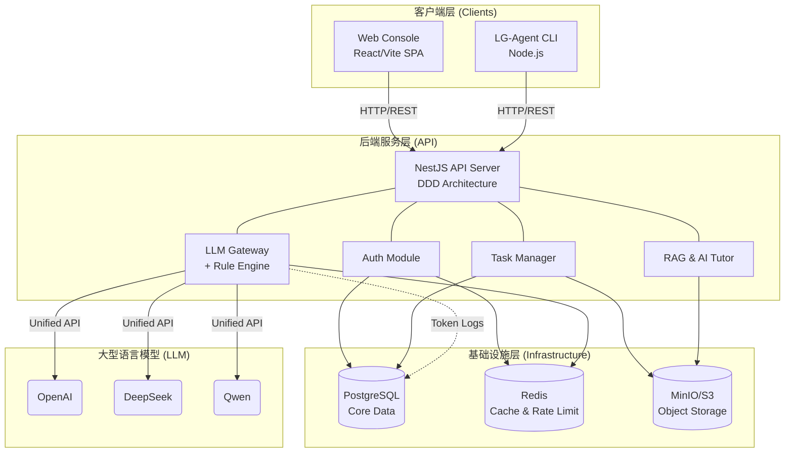

# LG-Agent 平台架构

## 系统概述

LG-Agent 是一个基于云原生原则设计的企业级 AI 辅助学习平台。该平台由一个统一的 Monorepo 组成，使用 Turborepo 和 pnpm workspaces 进行管理。

### 1. 核心服务 (Core Services)

- **Web 控制台 (`@lg-agent/web`)**: 一个基于 Vite 和 Ant Design 构建的现代 React 单页应用 (SPA)。它为导师 (Mentors) 和学员 (Trainees) 提供基于角色的仪表盘。
- **API 服务 (`@lg-agent/api`)**: 一个基于 NestJS 的后端，遵循领域驱动设计 (DDD)。它作为主要的编排层，负责身份验证、任务管理、RAG（检索增强生成）以及 LLM 网关路由。
- **命令行工具 (`@lg-agent/cli`)**: 一个 Node.js 命令行工具，允许开发者拉取课程、初始化工作区、运行本地测试并安全地提交他们的解答。

### 2. 数据持久化 (无状态架构)

为确保后端 API 能够在 Kubernetes 中进行水平扩展，状态被严格地在外部进行管理：

- **PostgreSQL**: 主要的关系型数据库，用于存储用户、课程、任务、学习记录和 AI 日志。通过 Prisma ORM 进行管理。
- **Redis**: 内存数据存储，用于 JWT 黑名单、速率限制和临时工作区缓存。
- **MinIO (兼容 S3)**: 对象存储，用于存储 RAG 文档、学员提交的文件以及系统备份。

### 3. AI 网关与推理 (AI Gateway & Inference)

AI 网关标准化了对多个 LLM 供应商（如 OpenAI、DeepSeek、Qwen）的访问。

- **敏感信息过滤**: 采用规则引擎在数据传输前剔除 PII（个人身份信息）和内部机密。
- **成本与审计日志**: 所有的 Prompt（提示词）都会被记录，Token 消耗会被聚合，指标数据通过 Prometheus 暴露。
- **AI 导师流水线**: 处理 RAG 检索、构建上下文（工作区代码），并以流式输出最终的回答。

### 4. 基础设施与平台运维 (Infrastructure & Platform Operations)

- **Docker**: 多阶段构建生成无发行版 (distroless)、非 root 的 Alpine 镜像。
- **Kubernetes (Helm)**: 统一的 Helm Charts 管理部署，通过 Nginx Ingress 将系统暴露到外部。
- **可观测性**: 基于 Prometheus（指标）和 Pino（结构化 JSON 日志）。
- **质量工程 (Quality Engineering)**: Playwright E2E、Vitest 单元测试以及 GitHub Actions CI 流水线，在每个 PR 上强制执行严格的质量门禁。
