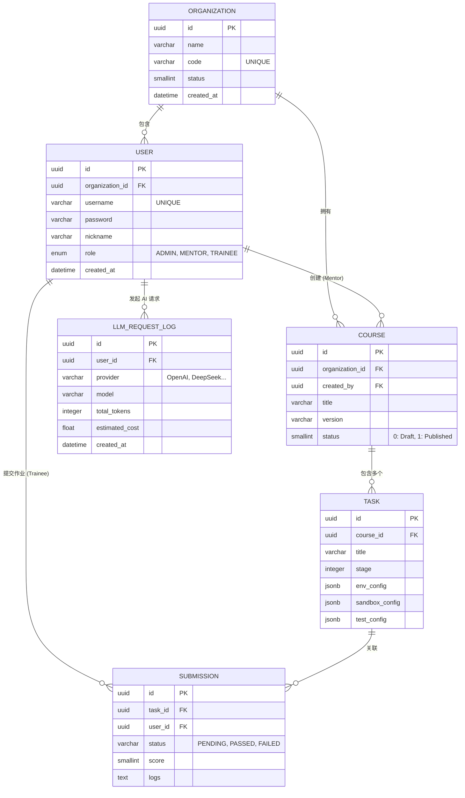

# 数据库设计 (Database Design)

LG-Agent 核心使用 **PostgreSQL** 作为业务数据持久层，并通过 **Prisma ORM** 进行管理。
本页面描述了系统中的核心实体及其关系。

## 核心实体关系图 (ER Diagram)

以下 Mermaid 实体关系图基于我们最新的 `schema.prisma` 生成。

## 核心表结构解析

### 1. 组织与多租户 (Organization)

平台在设计之初考虑了多租户 (Multi-tenancy)。每个 `User` 和 `Course` 必须归属于某一个 `Organization`。这允许不同的企业级客户在同一个平台上相互隔离。

### 2. 用户与权限 (User & Role)

`User` 表包含一个枚举字段 `role`：

- **`ADMIN`**: 租户管理员，负责管理组织内的其他用户。
- **`MENTOR`**: 导师，能够创建 `Course` 并管理其中的 `Task` 配置。
- **`TRAINEE`**: 学员，只能查阅课程、使用 CLI 提交 `Submission` 以及与 AI 导师对话。

### 3. 课程与任务 (Course & Task)

一个课程 (`Course`) 包含多个按阶段 (`stage`) 排序的任务 (`Task`)。
任务是系统的配置重灾区。`Task` 表大量使用了 `jsonb` 字段，以便灵活存储复杂嵌套的 Schema 校验配置，例如所需的镜像环境 (`env_config`) 和验证脚本 (`test_config`)。

### 4. 提交记录 (Submission)

记录学员每一次通过 CLI 推送的验证请求。沙盒引擎异步执行完毕后，会将状态 (`status`)、评分 (`score`) 和终端输出日志 (`logs`) 更新回该表。

### 5. AI 请求日志 (LlmRequestLog)

对于平台成本控制至关重要。每一次转发给外部供应商的请求，其消耗的 `promptTokens` 和 `completionTokens` 均会记录在此。配合 `MonitoringModule`，可以实现针对个人或组织的月度配额控制。
