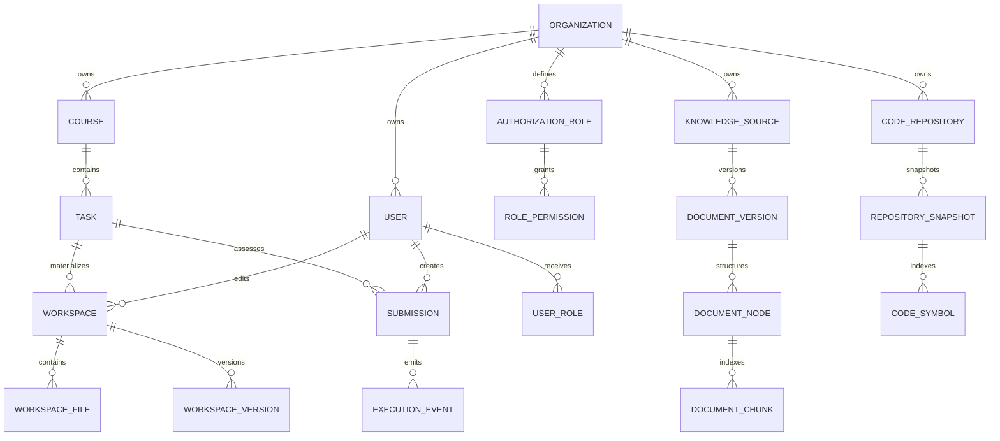

# 数据库设计

数据库基线是 `packages/api/prisma/schema.prisma` 与版本化 migration；禁止用 `prisma db push` 替代 migration。PostgreSQL 16 + pgvector 同时承载业务数据、执行事件、权限 registry、审计和结构化混合检索。

## 领域数据组

## 多租户与授权

Organization 是租户 seam。组织级 repository 操作必须携带 authenticated tenant actor，并在查询中同时约束资源 id 与 `organizationId`。`users.role` 只作为旧数据兼容桥；实际授权由 `permissions`、`authorization_roles`、`role_permissions`、`user_roles` 与 `permission_registry_state` 组成。发布前 reconcile 必须使 registry version/digest 与代码 manifest 一致，否则 readiness fail-closed。

## Authoring Workspace

`Workspace` 唯一约束为 `(userId, taskId)`，包含 baseline、metadata 与版本号；`WorkspaceFile` 保存路径、内容、语言和 dirty 状态；`WorkspaceVersion` 保存可恢复快照。默认最多 50 个版本、保留 90 天，实际值由环境变量覆盖。

## Submission 与执行

`Submission` 支持 `PENDING/RUNNING/PASSED/FAILED/ERROR/CANCELLED`，包含幂等键、attempt、租约 owner/heartbeat/expiry、retry、dead letter 与取消时间。`ExecutionEvent` 以 `(submissionId, sequence)` 唯一，供 durable 日志与 `Last-Event-ID` replay 使用。大日志可按 `SUBMISSION_ARCHIVE_THRESHOLD_BYTES` 策略归档。

## AI、对话与检索

- `LlmRequestLog` 保存 provider、model、token、成本、trace、prompt hash、rule hits 与 fallback，不保存原始 Prompt。
- `LlmAuditLog` 保存脱敏后的规则审计。
- 文档检索使用 `KnowledgeSource → DocumentVersion → DocumentNode → DocumentChunk`。
- 代码检索使用 `CodeRepository → RepositorySnapshot → CodeFile/CodeSymbol/CodeRelation`。
- `RetrievalTrace` 与 `RetrievalEvidence` 保存可解释证据；`ConversationSummary` 支持长对话压缩。

## 生命周期与索引

默认保留：Workspace version 90 天、Conversation 365 天、LLM request 180 天、LLM audit 365 天、AuditEvent 2555 天、ClientLog 30 天、ClientMetric 90 天。`DataLifecycleModule` 分批清理，生产变更必须同时更新 `.env.example`、运行手册与备份策略。

CI 会验证 Prisma schema、空库升级、前一 migration 升级、并发 migration、schema drift、关键查询计划，以及逻辑备份恢复后的约束、pgvector、权限表和检索表。
