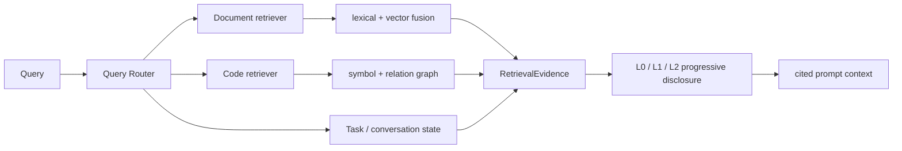

# AI 集成与检索架构

## LLM Gateway 与 adapter

所有 chat、stream、embed 调用进入 `LLMGatewayService`。`ILLMProvider` 是 seam，当前 adapter 为 OpenAI、DeepSeek 和 Mock；Qwen 等兼容模型通过 OpenAI-compatible base URL/model 接入，没有独立 `QwenProvider`。

Gateway 负责 provider 选择、fallback、超时/重试、用量与成本审计。业务 module 不直接实例化 SDK client。新增 provider 时实现同一 interface、注册到 `AiModule` composition root，并通过成功、失败、fallback、stream 和 embed contract tests。

## 安全规则与 Prompt

Rule Engine 在出站前执行关键词、regex、prompt-injection 和 masking 规则。原始 Prompt 不写入日志；`LlmRequestLog` 保存 SHA-256 hash 与脱敏后的 rule hits，`LlmAuditLog` 只保存规则 id/name/action。

Prompt 只能通过 `IPromptRepository` 获取。JSON 模板声明 `version`、`purpose`、`inputSchema` 和可选 `outputSchema`，加载、输入和结构化输出均执行 JSON Schema 校验。Tutor、AI Review 与任务生成不得在 TypeScript 中硬编码 system prompt。

## 版本化结构检索

- 文档按 source/version/node/chunk 建模，支持结构定位与版本激活。
- 代码按 repository/snapshot/file/symbol/relation 建模，禁止查询半构建 snapshot。
- `RetrievalTrace` 记录 route、耗时和证据；引用打开端点验证租户 ACL。
- rollout 模式为 `LEGACY`、`SHADOW`、`ACTIVE`，可按 Organization/Course/User 灰度，并可分别关闭 query router、code retrieval、progressive disclosure。
- `MemoryVectorStore` 用于开发测试；`RAG_VECTOR_STORE=pgvector` 使用 PostgreSQL 持久索引。

索引构建不阻塞 API 启动。管理员通过 `/api/v1/ai/knowledge/index/status` 查看状态、通过 `/api/v1/ai/knowledge/index/rebuild` 合并触发重建；检索管理页面还提供 index、health、shadow comparison 和 trace。

## 审计与保留

AI request 默认保留 180 天，AI audit 默认 365 天。`GET /api/v1/ai/audit/requests` 仅允许当前 Organization 的授权管理员读取并限制单次结果数。生产启用新检索路径前，运行 `pnpm --filter @lg-agent/api test:retrieval-gate`，并遵循 `docs/architecture/retrieval-rollout-runbook.md`。
