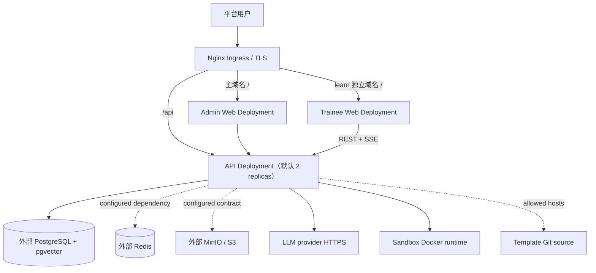

# 生产系统拓扑

生产 Helm chart 部署三个独立工作负载：API、Admin Web、Trainee Web。API 是模块化单体，不是微服务集群。

## 流量与状态

- Admin 和 Trainee 是 Nginx 托管的静态 SPA，各自使用独立 Deployment/Service。
- API 使用 `/api/v1` 前缀；Submission 与 Sandbox 执行日志通过 SSE 返回，不使用 WebSocket。WebSocket 仅用于 notification gateway。
- PostgreSQL 是 durable source of truth，包含 Authoring Workspace、Submission/ExecutionEvent、权限 registry、审计与检索索引。
- Redis、MinIO/S3 已进入配置/Secret 契约，但当前代码没有把它们作为核心业务 durable adapter；不可将其健康等同于应用健康。

## 副本与弹性

生产 values 将三个 Deployment 的 replicaCount 设为 2。当前 chart **没有 HPA**，扩缩容由显式 values 或平台侧额外资源完成；不要假设已自动弹性。chart 也没有内置 NetworkPolicy。

API readiness 校验 permission registry version/digest，liveness 校验进程路径与 PostgreSQL；当前不检查 Redis、对象存储或 LLM。

## Sandbox 运行前提

代码中的 Docker executor 会调用 Docker runtime。当前 chart 未声明 Docker socket、DinD sidecar 或远程 executor，因此集群必须另行提供并验证 Docker 执行能力；在完成该平台集成前，不能仅凭 Helm rollout 成功判定 Sandbox 可用。生产禁止 `SANDBOX_EXECUTOR=local`。
